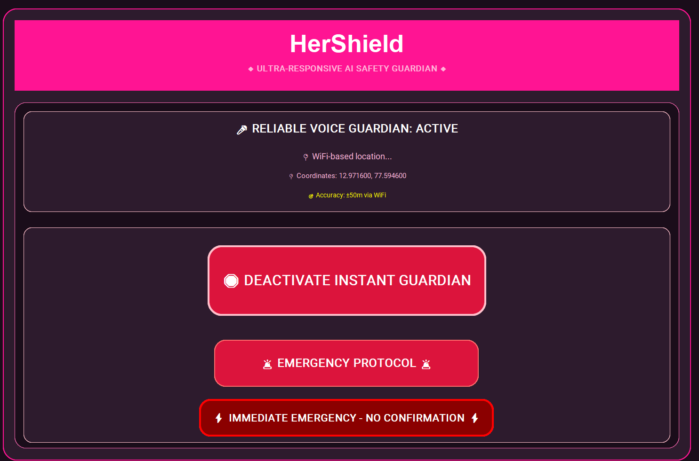
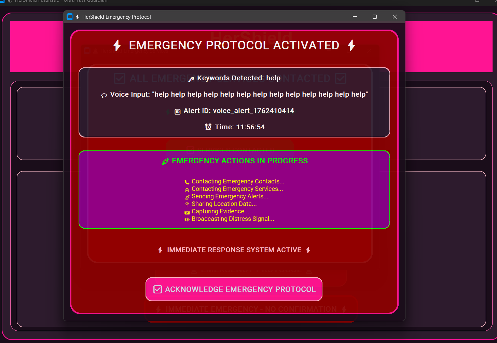
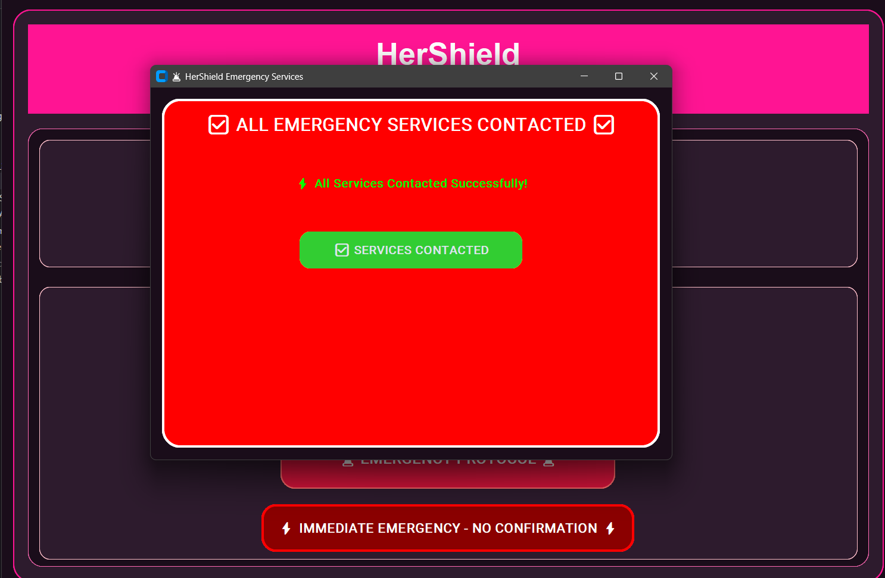

# 🛡️ HerShield - AI-Powered SOS Women Safety System

**An advanced AI-powered safety system designed to protect women through intelligent threat detection, voice recognition, and automated emergency response.**

## 📸 Screenshots

### Main Application Interface

*Futuristic HerShield interface with voice protection and emergency controls*

### Emergency Protocol Window

*Emergency protocol activation window with detected keywords and alert status*

### Emergency Services Contact

*Animated window showing emergency services being contacted with alerts and sounds*

## 🚀 Quick Start

```bash
# Clone the repository
git clone https://github.com/Valise-team-8/HerShield---AI-powered-SOS-women-Safety-System.git
cd HerShield---AI-powered-SOS-women-Safety-System

# Install dependencies
pip install -r requirements.txt

# Run the application
python main.py
```

## ✨ Features

### 🎤 **Voice Recognition & AI Detection**
- **100+ Emergency Keywords** - Detects distress calls in multiple languages
- **AI Sound Analysis** - Recognizes screams, crashes, and distress sounds
- **Offline Capability** - Works without internet connection
- **Real-time Processing** - Instant threat detection

### 🚨 **Progressive Alert System**
- **0 Seconds** - Immediate local alerts
- **15 Seconds** - SMS/Email notifications to emergency contacts
- **30 Seconds** - Automated emergency service calls
- **Escalation Control** - Press ESC to stop escalation

### 📍 **Enhanced Location Services**
- **GPS Tracking** - Precise location detection
- **IP Geolocation** - Backup location service
- **WiFi Positioning** - Indoor location accuracy
- **Real-time Updates** - Continuous location monitoring

### 📷 **Evidence Capture**
- **Automatic Photos** - Captures evidence during alerts
- **Video Recording** - Records incidents for documentation
- **Secure Storage** - Local and cloud backup options
- **Privacy Protected** - User-controlled data access

### ☁️ **Cloud Integration**
- **Firebase Backup** - Secure cloud data storage
- **Multi-device Sync** - Access from anywhere
- **Emergency Logs** - Detailed incident tracking
- **Offline Mode** - Full functionality without internet

### 🔔 **Multiple Alert Channels**
- **Email Notifications** - Free emergency alerts
- **SMS Alerts** - Direct contact notifications
- **Discord/Telegram** - Social platform integration
- **Voice Announcements** - Audio alert system

## 🛠️ Installation

### Prerequisites
- Python 3.8 or higher
- Microphone access
- Internet connection (optional for offline mode)

### Dependencies
```bash
pip install pygame speechrecognition pyaudio opencv-python
pip install firebase-admin requests geocoder folium
pip install pyttsx3 plyer tkinter customtkinter
```

### Firebase Setup (Optional)
1. Create a Firebase project at https://console.firebase.google.com/
2. Enable Realtime Database
3. Generate a service account key
4. Copy `serviceAccountKey.template.json` to `serviceAccountKey.json`
5. Replace the template values with your actual Firebase credentials

*Note: The system works perfectly without Firebase using local storage.*

**⚠️ Security:** Never commit `serviceAccountKey.json` to version control. It's already in `.gitignore`.

## 🎯 Usage

### Starting the System
```bash
python main.py
```

### First-Time Setup
1. **Enter Your Details** - Name, email, phone number
2. **Add Emergency Contacts** - Up to 5 emergency contacts
3. **Choose Alert Methods** - Email, SMS, or social platforms
4. **Test the System** - Use the "TEST SYSTEM" button

### Keyboard Shortcuts
- **ESC** - Acknowledge alerts and stop escalation
- **Ctrl+Shift+A** - Quick alert acknowledgment
- **F12** - Emergency acknowledgment
- **Ctrl+E** - Manual emergency alert
- **Ctrl+T** - Test system functionality
- **Ctrl+S** - Start/Stop protection mode

### Voice Commands
The system recognizes 100+ emergency keywords including:
- "Help me", "Emergency", "Call police"
- "I'm in danger", "Someone help"
- Distress sounds and screams
- Domestic violence indicators

## 🏗️ System Architecture

```
HerShield/
├── main.py                    # Main application
├── core/                      # Core system modules
│   ├── voice_recognition.py   # Voice detection engine
│   ├── ai_threat_detection.py # AI-powered threat analysis
│   ├── alert_system.py        # Emergency alert management
│   ├── location_service.py    # GPS and location tracking
│   ├── firebase_service.py    # Cloud integration
│   └── escalation_system.py   # Progressive alert escalation
├── data/                      # Local data storage
├── evidence/                  # Captured photos/videos
└── config/                    # Configuration files
```

## 🔧 Configuration

### Alert Settings
- **Response Time** - Customize escalation timing
- **Contact Priority** - Set emergency contact order
- **Alert Sensitivity** - Adjust detection thresholds
- **Privacy Mode** - Control data sharing and storage

### Location Settings
- **GPS Accuracy** - Set location precision requirements
- **Update Frequency** - Configure location update intervals
- **Sharing Permissions** - Control location data access

## 🛡️ Privacy & Security

- **Local Data Storage** - All personal data stored locally by default
- **Encrypted Communications** - Secure alert transmissions
- **User Control** - Complete control over data sharing
- **No Tracking** - No user behavior tracking or analytics
- **Open Source** - Transparent and auditable code

## 🚨 Emergency Response Flow

1. **Threat Detection** - Voice/AI detects potential danger
2. **Immediate Alert** - Local notification and sound alarm
3. **Location Capture** - GPS coordinates and address lookup
4. **Evidence Collection** - Automatic photo/video capture
5. **Contact Notification** - SMS/Email to emergency contacts
6. **Service Integration** - Optional emergency service alerts
7. **Continuous Monitoring** - Ongoing threat assessment


### Development Setup
```bash
git clone https://github.com/Valise-team-8/HerShield---AI-powered-SOS-women-Safety-System.git
cd HerShield---AI-powered-SOS-women-Safety-System
pip install -r requirements-dev.txt
python -m pytest tests/
```
